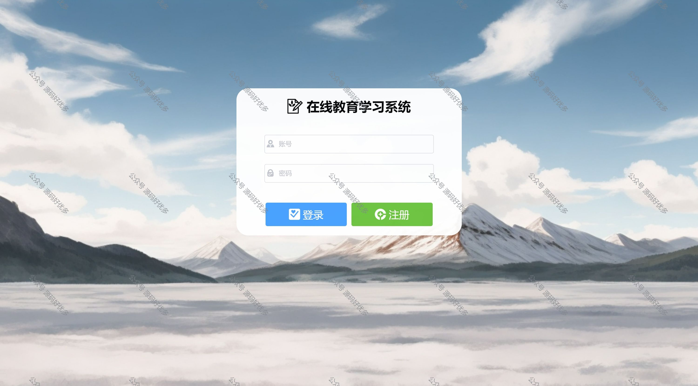
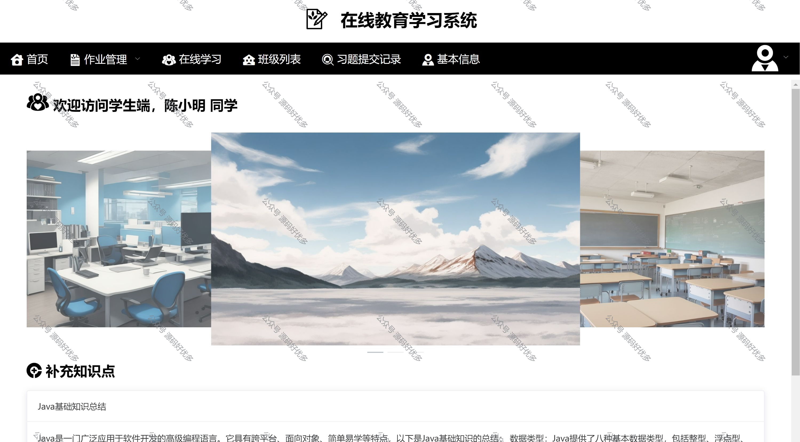

 
## 查看主页获取源码

> **作者介绍**： **✌**全网粉丝10W+本平台特邀作者、博客专家、CSDN新星计划导师、java领域优质创作者,博客之星、掘金/华为云/阿里云/InfoQ等平台优质作者、专注于项目实战 **✌**

  

### 一、作品包含

源码+数据库+设计文档万字+PPT+全套环境和工具资源+部署教程

### 二、项目技术

前端技术：Html、Css、Js、Vue、Element-ui

数据库：MySQL

后端技术：Java、Spring Boot、MyBatis

  

### 三、运行环境

开发工具：IDEA/eclipse

数据库：MySQL8.0

数据库管理工具：Navicat10以上版本

环境配置软件： JDK1.8+Maven3.6.3

前端Nodejs：16

  

### 四、项目介绍
项目编号：springbootA022

系统设计三个角色，学生端，教师端，管理员端

1.管理员端：对学生和老师基本信息进行增删改查，管理各个班级的作业，管理全校师生的班级、试题、科目、作业、以及教师发布的知识点等等

2.教师端：对自己班级内的学生进行增删改擦、审核学生加入班级的申请、对试题进行增删改查、回答学生的疑问、上传学生学习视频等等

3.学生端：查看教师发布的学习视频，完成教师布置的作业，申请加入某个班级等等

### 五、运行截图

  
